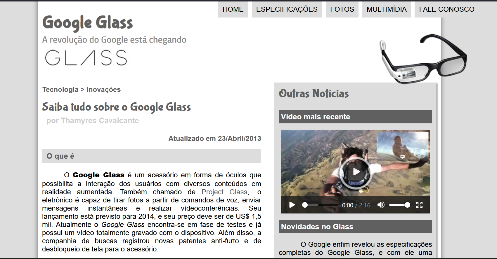

# Projeto Google Glass

Projeto de HTML e CSS - professor Gustavo Guanabara Curso em video

 

  <a href="#-tecnologias">Tecnologias</a>&nbsp;&nbsp;&nbsp;|&nbsp;&nbsp;&nbsp;  
  <a href="#-projeto">Projeto</a>&nbsp;&nbsp;&nbsp;|&nbsp;&nbsp;&nbsp;  
  <a href="#-gif">Vídeo</a>&nbsp;&nbsp;&nbsp;&nbsp;&nbsp;&nbsp;

 

## 🚀 Tecnologias

Esse projeto foi desenvolvido com as seguintes tecnologias:

- HTML5
- CSS
- JavaScript
- Git e Github

 

## 💻 Projeto

Projeto realizado com as tecnologias de HTML5 + CSS3 + JavaScript, criação de um site completo do zero com o professor Gustavo Guanabara do Curso em vídeo.

 

## 📸 Vídeo

Projeto do Google Glass

</img>

<video controls="controls" width="70%" height="300" >
  <source src="_interface/proj/Google_Glass.mp4" />
</video>

 

- Me siga nas redes sociais:
- [Linkedin](https://www.linkedin.com/in/thamyrescavalcante/)
- [Instagran](https://www.instagram.com/thamyres__cavalcante/)

 

---

Feito com ♥ by Thamyres Cavalcante.

